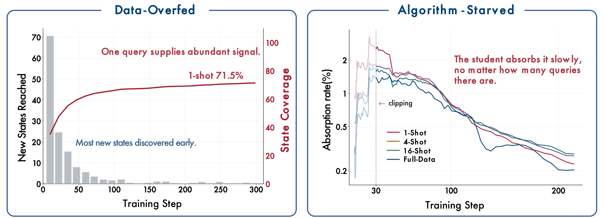
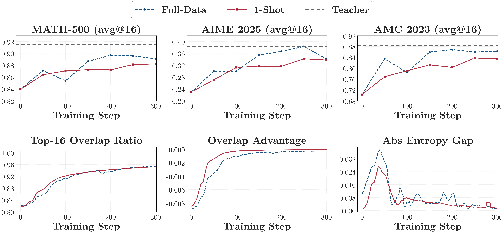
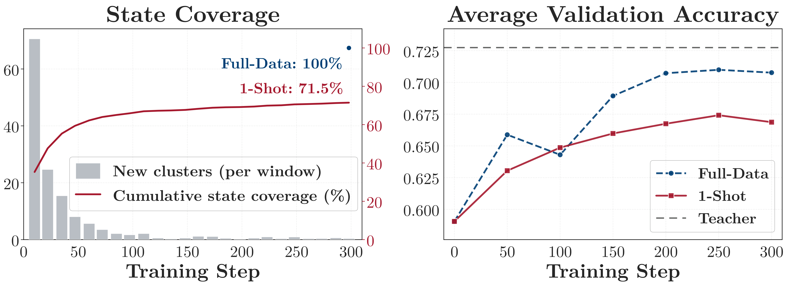
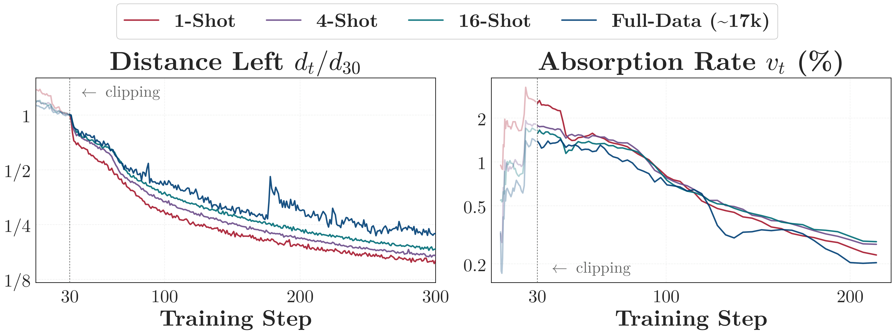
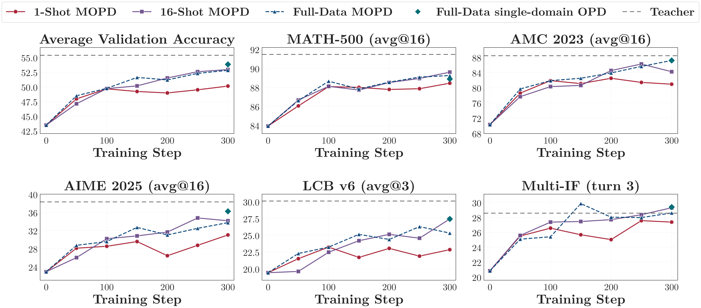
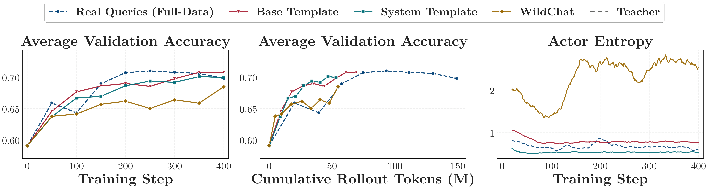

<div align="center">
  <h1>Rethinking On-Policy Distillation of Large Language Models II: One Training Example</h1>
  <p>
    <a href="https://arxiv.org/abs/XXXX.XXXXX"></a>&nbsp;&nbsp;
    <a href="https://github.com/Thinking-Space/One-Shot-OPD"></a>&nbsp;&nbsp;
    <a href="https://huggingface.co/papers/XXXX.XXXXX"></a>&nbsp;&nbsp;
    <a href="https://huggingface.co/collections/Thinking-Space/one-shot-opd"></a>
  </p>
</div>


<div align="center">
  <p>
    <a href="#news">🎉 News</a> •
    <a href="#links">🔗 Links</a> •
    <a href="#introduction">📖 Introduction</a> •
    <a href="#key-findings">🔍 Key Findings</a>
  </p>
  <p>
    <a href="#getting-started">✨ Getting Started</a> •
    <a href="#contact">📨 Contact</a> •
    <a href="#citation">🎈 Citation</a> •
    <a href="#Acknowledgement">🌻 Acknowledgement</a>

  </p>
</div>


---

## 🎉News

- **[2026-xx-xx]** Our paper is on arXiv. Check it out: [Paper](https://arxiv.org/abs/XXXX.XXXXX).
- **[2026-09-03]** Initial release of the OPD and MOPD training and evaluation code, implemented in [veRL](https://github.com/volcengine/verl).

<a id="links"></a>

## 🔗Links

- 📜 [Paper](https://arxiv.org/abs/XXXX.XXXXX)
- 🤗 [Hugging Face Paper Page](https://huggingface.co/papers/XXXX.XXXXX)
- 🤗 [Resource Collection](https://huggingface.co/collections/Thinking-Space/one-shot-opd)
- 💻 [GitHub](https://github.com/Thinking-Space/One-Shot-OPD)
- 📕 Part I of this series: [Rethinking On-Policy Distillation of Large Language Models](https://arxiv.org/abs/2604.13016)

<a id="introduction"></a>

## 📖Introduction


On-policy distillation (OPD) combines student-generated rollouts with dense token-level supervision from a teacher. Existing work has mainly studied its algorithmic behavior, leaving the role of training data unclear. We examine this role at the data-minimal limit by training on a **single query**. One-shot OPD keeps improving for hundreds of steps and recovers most of full-data OPD's gain across task domains and model families.

We explain this result through the ***states*** visited during training and the ***rate*** at which the student aligns with the teacher. A single query reaches **71.5%** state coverage relative to full-data OPD, with most coverage appearing in the first 100 steps. Adding semantically distinct queries increases state coverage and validation accuracy together, and sixteen queries reach **98.9%** coverage and match full-data training. Yet alignment slows at a similar pace whether OPD trains on one query or all 17k, and even a fixed set of states takes hundreds of steps to absorb.

**OPD is therefore data-overfed but algorithm-starved:** its rollouts quickly expose broad supervision, while the student absorbs that supervision increasingly slowly.

This repository is an empirical study rather than a new algorithm. Its two contributions beyond the phenomenon itself are a pair of diagnostics that can be computed for any OPD run:

- **State coverage:** the fraction of the state-space clusters visited by full-data OPD that a given setting also reaches. It measures the *breadth* of supervision a query set induces, rather than the number of queries it contains.
- **Absorption rate:** the proportion of the remaining teacher-student distance that one update removes. It measures how fast the student consumes the supervision it is already given.



<a id="key-findings"></a>

## 🔍Key Findings

### How much of full-data OPD does a single query recover?

Averaged over MATH-500, AMC 2023, and AIME 2025, one-shot OPD reaches 68.5 at step 300 against 69.8 for full-data OPD, starting from a student at 59.1. That is **87%** of full-data OPD's gain and **69%** of the teacher-student gap, in mathematics, at step 300. The effect also holds for code generation, instruction following, and agentic tool use, and for three different student-teacher families.



The gain is insensitive to query difficulty, response-length cap, and rollout temperature. A query the student never solves is about as effective as one it always solves.

> [!NOTE]
> Training longer does not close the gap. Over a 1000-step run, one-shot OPD recovers **72%** of full-data OPD's gain, down from 87% at step 300: the one-shot curve flattens while the full-data curve keeps rising. Beyond step 300 the two stay within a band of about 3 points and the recovered fraction moves between 62% and 89%, so what one query "recovers" depends on where you read it. We report both numbers because the difference is part of the finding.

### Why does one query supply so much supervision?

OPD trains on states, not queries. A query and a sampled response produce one state at every token position, each paired with a teacher target, so 64 rollouts per update yield tens of thousands of supervised states from a single query. Measured against the state space full-data OPD visits, one query reaches **71.5%** coverage by step 300, of which 65.9% is already reached by step 100 — the remaining 200 steps add only 5.6 percentage points.



Coverage, not count, is what an added query is worth. Semantically distinct queries raise coverage and accuracy together, and 16 of them reach **98.9%** coverage and match full-data OPD.

### Why does a single query keep paying off for hundreds of steps?

Because the student absorbs the supervision slowly, and gets slower. The teacher-student distance falls for the whole run, so the student is never stuck, but the absorption rate declines throughout. Crucially, this slowdown is **insensitive to the size of the training set**: OPD trained on 1, 4, 16, or all 17k queries each removes **78% to 84%** of its step-30 distance by step 300.



An ablation on fixed states points the same way: a run that reuses 64 trajectories sampled once from the initial student still gains accuracy steadily for about 200 steps. A steady supply of fresh states is therefore not what keeps a run going that long.

### Does the picture survive multiple teachers and content-light inputs?

Yes, in both stress tests we ran. In multi-teacher OPD (MOPD), where one student is trained on three domains at once and each query is routed to its domain teacher, **16** semantically diverse queries per domain recover **101%** of full-data MOPD's gain.



As a further stress test, we replace the real query with a content-light template and with off-domain [WildChat](https://huggingface.co/datasets/allenai/WildChat-1M) queries.



> [!NOTE]
> Task content and induced state coverage can come apart. Both the template and the WildChat queries track the real-data baseline while spending a third to a half of its rollout tokens, even though less than **1%** of the WildChat queries are math-related. This does not make task content generally dispensable — in-domain content is still worth about a point in mathematics — but it does mean the two can be pulled apart, at least in the settings we tested.

<a id="getting-started"></a>

## ✨Getting Started

### Environment Setup

We implement OPD and MOPD by extending [veRL](https://github.com/volcengine/verl). The vendored copy under [`verl/`](verl/) is what the launchers run, so a fresh clone needs no separate veRL install — only its dependencies.

```text
Python 3.12      vllm 0.28.0 (torch 2.13.0  transformers 5.10.4)      verl 0.9.0
```

```bash
git clone https://github.com/Thinking-Space/One-Shot-OPD.git
cd One-Shot-OPD

export MODEL_BASE=/your/models          # student + teacher checkpoints live here
export CONDA_ENV_BIN=/your/env/bin      # vllm >= 0.18, transformers 5.x
```

- Reference numbers come from a single 8-GPU node (H100/A100 80 GB); the teacher worker shares the actor's GPU pool.
- No dataset ships with this repository. Data is rebuilt from public sources by [`data/prep/`](data/prep/README.md); the expected layout, row counts, and `data_source` values are in [`data/README.md`](data/README.md).

### Training

| Script | Reward | Teachers |
| --- | --- | --- |
| `grpo.sh` | rule-based verifier, grouped over `n` samples | none |
| `opd.sh` | teacher reverse KL | one |
| `mopd.sh` | teacher reverse KL, routed per row by the `ability` column | several |

```bash
bash recipe/grpo.sh                 # baseline
bash recipe/opd.sh                  # OPD, full data
MODE=oneshot bash recipe/opd.sh     # One-shot OPD
MODE=template bash recipe/opd.sh    # the student writes its own input
bash recipe/mopd.sh                 # MOPD, three teachers
```

`DOMAIN` selects the teacher and the parquets, `MODE` selects which prompts are read, and the two are independent. Anything appended on the command line goes to Hydra.

```bash
DOMAIN=code bash recipe/opd.sh              # math (default) / code / fc / if
DOMAIN=fc MODE=oneshot bash recipe/opd.sh   # only math ships a 1-shot corpus
MODE=oneshot LOG_PROB_TOP_K=16 bash recipe/opd.sh trainer.total_training_steps=10
```

For MOPD, each teacher is a name–path pair passed to `multi_teacher_args`. Adding one means adding a path variable and extending both the routing map and the call:

```bash
export TEACHER_AGENTIC_PATH=${TEACHER_AGENTIC_PATH:-${MODEL_BASE}/MyAgentTeacher}
export ABILITY_TO_TEACHER='{math:math,code:code,instruction_following:if,function_calling:agentic}'

launch "$EXPERIMENT_NAME" \
    $(common_args) \
    $(mode_args) \
    $(multi_teacher_args \
        "math:${TEACHER_MATH_PATH}" \
        "code:${TEACHER_CODE_PATH}" \
        "if:${TEACHER_IF_PATH}" \
        "agentic:${TEACHER_AGENTIC_PATH}") \
    ...
```

<details>
<summary><b>Key parameters</b></summary>

| Parameter | Default | Description |
|-----------|---------|-------------|
| `DOMAIN` | `math` | `math` / `code` / `fc` / `if` — selects teacher and datasets |
| `MODE` | `full` | `full` / `oneshot` / `template` — selects the data variant |
| `ACTOR_MODEL_PATH` | per `DOMAIN` | Student (policy) model to be trained |
| `TEACHER_MODEL_PATH` | per `DOMAIN` | Frozen teacher that provides the token-level reward |
| `MODEL_BASE` | required | Directory the two model paths resolve against |
| `N_RESPONSES` | `1` | Rollout responses per prompt |
| `LOG_PROB_TOP_K` | `0` | Top-K tokens kept when computing the token reward; `0` falls back to sampled-token OPD |
| `METRIC_TOP_K` | `0` | Same computation, **observability only** — the reward stays plain reverse KL |
| `TOP_K_STRATEGY` | `only_stu` | Support set: `only_stu` / `only_tch` / `intersection` / `union` / `union-intersection` |
| `REWARD_WEIGHT_MODE` | `student_p` | Token weighting: `student_p` / `teacher_p` / `none` |
| `VAL_N` / `VAL_TEMPERATURE` / `VAL_TOP_P` | `16` / `0.7` / `0.9` | Validation sampling, giving `avg@16` |

</details>

> [!NOTE]
> The two top-K knobs mean different things. `LOG_PROB_TOP_K` changes the training reward; `METRIC_TOP_K` only measures it.
>
> | Knob | Semantics | `rm_scores` | `opd/top_k_mode` |
> | --- | --- | --- | --- |
> | `LOG_PROB_TOP_K=K` | top-K **is** the training reward | `(B, T, K)` | 1 |
> | `METRIC_TOP_K=K` | top-K is **observability only** | `(B, T)` reverse KL, unchanged | 0 |
> | both `0` | off | `(B, T)` reverse KL | absent |
>

<details>
<summary><b>Default hyperparameters used in the paper</b></summary>

| Item | Value |
|---|---|
| Rollout batch size | 64 |
| Mini batch size | 64 |
| Responses per prompt | 1 |
| KL coefficient | 0.0 |
| LogProb top-`k` | 0 (default) / 16 |
| Top-`k` strategy | student top-`k` |
| Loss aggregation | `token-mean` |
| Training temperature | 1.0 |
| Top-`p` | 1.0 |
| Optimizer | AdamW (beta1 0.9, beta2 0.999, weight decay 0.01) |
| Learning rate | 1e-6 |
| Gradient clip norm | 1.0 |
| Max prompt length | 1024 (math); 4096 (code, IF, agentic) |
| Max response length | 7680 (math, code, IF); 2048 (agentic) |

The mathematical-reasoning runs of the one-shot section optimize the top-`k` advantage with `k = 16`; the code, instruction-following, and agentic runs optimize the sampled-token advantage. MOPD differs in three places: three teachers (math / code / instruction following), `token-mean` replaced by `seq-mean-token-mean`, and a max prompt length of 4096 throughout.

</details>

### Validation

```bash
VAL_ONLY=True bash recipe/opd.sh    # score the current weights, then exit
```

The in-training validation loop gives `avg@16` at temperature 0.7. The evaluation protocols reported in the paper are:

| Domain | Benchmarks | Protocol | Response cap |
|---|---|---|---|
| Math | MATH-500, AMC 2023, AIME 2025 | avg@16 | 31,744 |
| Code | LiveCodeBench v6 | avg@3, official execution-based evaluator | 65,536 |
| Instruction following | Multi-IF | final-turn score averaged over its eight languages | 16,384 per turn |
| Agentic tool use | BFCL v3 | avg@8 over the evaluated subsets | 4,096 |

#### Multi-IF

Multi-IF is multi-turn — turn 2's prompt depends on turn 1's answer — which the in-training loop cannot produce. It runs outside verl, and IF training sets `VAL_FILES='[]'`.

```bash
# 8 GPUs, one vLLM engine each (1.5B model, no tensor parallelism)
CUDA_VISIBLE_DEVICES=0,1,2,3,4,5,6,7 \
python3 eval/run_if_eval.py multiif --model <hf-dir> --out results/multiif_s50

# Re-score existing generations after a scorer or aggregation change, no GPU
python3 eval/run_if_eval.py rescore --out results/multiif_s50

# Smoke test, a few minutes
python3 eval/run_if_eval.py multiif --model <hf-dir> --out results/smoke --limit 24
```

<a id="contact"></a>

## 📨Contact

- Bingxiang He: [hebx24@mails.tsinghua.edu.cn](mailto:hebx24@mails.tsinghua.edu.cn)
- Ning Ding: [dingning@tsinghua.edu.cn](mailto:dingning@tsinghua.edu.cn)
- Chaojun Xiao: [xcj@tsinghua.edu.cn](mailto:xcj@tsinghua.edu.cn)

<a id="citation"></a>

## 🎈Citation

If you find this work helpful, please cite us:

```bibtex
@article{fu2026oneshotopd,
  title={Rethinking On-Policy Distillation of Large Language Models II: One Training Example},
  author={Fu, Zixuan and He, Bingxiang and Zuo, Yuxin and Huang, Haohuan and Zhang, Jinqian and Xiao, Ruhang and Qian, Cheng and Luo, Qinyu and Gao, Huan-ang and Wang, Yudong and Ding, Ning and Liu, Zhiyuan and Xiao, Chaojun},
  journal={arXiv preprint arXiv:XXXX.XXXXX},
  year={2026}
}
```

<a id="Acknowledgement"></a>

## 🌻 Acknowledgement

We implement our OPD and MOPD training extending from [veRL](https://github.com/volcengine/verl). Our students and teachers are public checkpoints from the DeepSeek-R1-Distill, JustRL, Nemotron-Research-Reasoning, Hammer, Llama, Qwen2.5-Coder, and OLMo releases, listed with full identifiers in the setup table above. Our training and evaluation data mainly include [DAPO-Math-17K](https://huggingface.co/datasets/BytedTsinghua-SIA/DAPO-Math-17k), [Open-R1 Codeforces](https://huggingface.co/datasets/open-r1/codeforces), [TACO](https://huggingface.co/datasets/BAAI/TACO), [xLAM-function-calling-60K](https://huggingface.co/datasets/Salesforce/xlam-function-calling-60k), MATH-500, LiveCodeBench, Multi-IF, and BFCL. We use [BGE-M3](https://github.com/FlagOpen/FlagEmbedding) for semantic clustering. Thanks for their great contributions!

We welcome everyone to open an issue if a configuration in this repository does not reproduce the numbers above, and we will address it in the next release.

## License

The code in this repository is released under the Apache License 2.0. The released model checkpoints are subject to the license terms of their respective base models. Please refer to the corresponding model cards for details.
