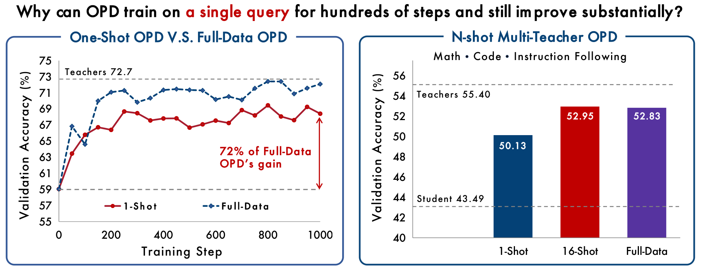

<div align="center">
  <h1>Rethinking On-Policy Distillation of Large Language Models II: One Training Example</h1>
  <p>
    <a href="https://arxiv.org/abs/XXXX.XXXXX"></a>&nbsp;&nbsp;
    <a href="https://github.com/Thinking-Space/One-Shot-OPD"></a>&nbsp;&nbsp;
    <a href="https://huggingface.co/papers/XXXX.XXXXX"></a>&nbsp;&nbsp;
    <a href="https://huggingface.co/collections/Thinking-Space/one-shot-opd"></a>
  </p>
</div>
<div align="center">
  <p>
    <a href="#news">🎉 News</a> •
    <a href="#Overview">📖 Introduction</a> •
    <a href="#getting-started">✨ Getting Started</a>
 </p>
 <p>
    <a href="#contact">📨 Contact</a> •
    <a href="#citation">🎈 Citation</a> 
 </p>
</div>
---

## 🎉News

- **[2026-09-04]** Part II: We examine the role of training data in on-policy distillation (OPD) at the data-minimal limit by training on a single query, and find that OPD is data-overfed but algorithm-starved. Check it out: [Paper](https://arxiv.org/abs/XXXX.XXXXX).
- **[2026-04-15]** Part I of this series: [Rethinking On-Policy Distillation of Large Language Models](https://arxiv.org/abs/2604.13016)

<a id="introduction"></a>

## 📖Overview



On-policy distillation (OPD) combines student-generated rollouts with dense token-level supervision from a teacher. Existing work has mainly studied its algorithmic behavior, leaving the role of training data unclear. We examine this role at the data-minimal limit by training on a single query. One-shot OPD keeps improving for hundreds of steps and recovers most of full-data OPD's gain across task domains and model families. We explain this result through the *states* visited during training and the *rate* at which the student aligns with the teacher. A single query reaches 71.5% state coverage relative to full-data OPD, with most coverage appearing in the first 100 steps. Adding semantically distinct queries increases state coverage and validation accuracy together, and sixteen queries reach 98.9% coverage and match full-data training. Yet alignment slows at a similar pace whether OPD trains on one query or all 17k, and even a fixed set of states takes hundreds of steps to absorb. OPD is therefore data-overfed but algorithm-starved. Its rollouts quickly expose broad supervision, while the student absorbs that supervision increasingly slowly. The state-coverage result extends to multi-teacher OPD, where 16 semantically diverse queries per domain match full-data MOPD. As a further stress test, content-light templates and off-domain WildChat queries also approach the real-query baseline. Task content and induced state coverage can therefore come apart. We hope these findings direct future work toward the step efficiency of OPD, and prompt a re-examination of the data and the mechanisms behind its recent successes in frontier post-training.

<a id="getting-started"></a>

## ✨Getting Started

### Environment Setup

We implement OPD and MOPD by extending [veRL](https://github.com/volcengine/verl). The vendored copy under [`verl/`](verl/) is what the launchers run, so a fresh clone needs no separate veRL install — only its dependencies.

```text
Python 3.12      vllm 0.28.0 (torch 2.13.0  transformers 5.10.4)      verl 0.9.0
```

```bash
git clone https://github.com/Thinking-Space/One-Shot-OPD.git
cd One-Shot-OPD

export MODEL_BASE=/your/models          # student + teacher checkpoints live here
export CONDA_ENV_BIN=/your/env/bin      # vllm >= 0.18, transformers 5.x
```

- Reference numbers come from a single 8-GPU node (H100/A100 80 GB); the teacher worker shares the actor's GPU pool.
- No dataset ships with this repository. Data is rebuilt from public sources by [`data/prep/`](data/prep/README.md); the expected layout, row counts, and `data_source` values are in [`data/README.md`](data/README.md).

### Training

| Script | Reward | Teachers |
| --- | --- | --- |
| `grpo.sh` | rule-based verifier, grouped over `n` samples | none |
| `opd.sh` | teacher reverse KL | one |
| `mopd.sh` | teacher reverse KL, routed per row by the `ability` column | several |

```bash
bash recipe/grpo.sh                 # baseline
bash recipe/opd.sh                  # OPD, full data
MODE=oneshot bash recipe/opd.sh     # One-shot OPD
MODE=template bash recipe/opd.sh    # the student writes its own input
bash recipe/mopd.sh                 # MOPD, three teachers
```

`DOMAIN` selects the teacher and the parquets, `MODE` selects which prompts are read, and the two are independent. Anything appended on the command line goes to Hydra.

```bash
DOMAIN=code bash recipe/opd.sh              # math (default) / code / fc / if
DOMAIN=fc MODE=oneshot bash recipe/opd.sh   # only math ships a 1-shot corpus
MODE=oneshot LOG_PROB_TOP_K=16 bash recipe/opd.sh trainer.total_training_steps=10
```

For MOPD, each teacher is a name–path pair passed to `multi_teacher_args`. Adding one means adding a path variable and extending both the routing map and the call:

```bash
export TEACHER_AGENTIC_PATH=${TEACHER_AGENTIC_PATH:-${MODEL_BASE}/MyAgentTeacher}
export ABILITY_TO_TEACHER='{math:math,code:code,instruction_following:if,function_calling:agentic}'

launch "$EXPERIMENT_NAME" \
    $(common_args) \
    $(mode_args) \
    $(multi_teacher_args \
        "math:${TEACHER_MATH_PATH}" \
        "code:${TEACHER_CODE_PATH}" \
        "if:${TEACHER_IF_PATH}" \
        "agentic:${TEACHER_AGENTIC_PATH}") \
    ...
```

<details>
<summary><b>Key parameters</b></summary>

| Parameter | Default | Description |
|-----------|---------|-------------|
| `DOMAIN` | `math` | `math` / `code` / `fc` / `if` — selects teacher and datasets |
| `MODE` | `full` | `full` / `oneshot` / `template` — selects the data variant |
| `ACTOR_MODEL_PATH` | per `DOMAIN` | Student (policy) model to be trained |
| `TEACHER_MODEL_PATH` | per `DOMAIN` | Frozen teacher that provides the token-level reward |
| `MODEL_BASE` | required | Directory the two model paths resolve against |
| `N_RESPONSES` | `1` | Rollout responses per prompt |
| `LOG_PROB_TOP_K` | `0` | Top-K tokens kept when computing the token reward; `0` falls back to sampled-token OPD |
| `METRIC_TOP_K` | `0` | Same computation, **observability only** — the reward stays plain reverse KL |
| `TOP_K_STRATEGY` | `only_stu` | Support set: `only_stu` / `only_tch` / `intersection` / `union` / `union-intersection` |
| `REWARD_WEIGHT_MODE` | `student_p` | Token weighting: `student_p` / `teacher_p` / `none` |
| `VAL_N` / `VAL_TEMPERATURE` / `VAL_TOP_P` | `16` / `0.7` / `0.9` | Validation sampling, giving `avg@16` |

> [!NOTE]
> The two top-K knobs mean different things. `LOG_PROB_TOP_K` changes the training reward; `METRIC_TOP_K` only measures it.
>
> | Knob | Semantics | `rm_scores` | `opd/top_k_mode` |
> | --- | --- | --- | --- |
> | `LOG_PROB_TOP_K=K` | top-K **is** the training reward | `(B, T, K)` | 1 |
> | `METRIC_TOP_K=K` | top-K is **observability only** | `(B, T)` reverse KL, unchanged | 0 |
> | both `0` | off | `(B, T)` reverse KL | absent |
>

</details>

<details>
<summary><b>Default hyperparameters used in the paper</b></summary>

| Item | Value |
|---|---|
| Rollout batch size | 64 |
| Mini batch size | 64 |
| Responses per prompt | 1 |
| KL coefficient | 0.0 |
| LogProb top-`k` | 0 (default) / 16 |
| Top-`k` strategy | student top-`k` |
| Loss aggregation | `token-mean` |
| Training temperature | 1.0 |
| Top-`p` | 1.0 |
| Optimizer | AdamW (beta1 0.9, beta2 0.999, weight decay 0.01) |
| Learning rate | 1e-6 |
| Gradient clip norm | 1.0 |
| Max prompt length | 1024 (math); 4096 (code, IF, agentic) |
| Max response length | 7680 (math, code, IF); 2048 (agentic) |

The mathematical-reasoning runs of the one-shot section optimize the top-`k` advantage with `k = 16`; the code, instruction-following, and agentic runs optimize the sampled-token advantage. MOPD differs in three places: three teachers (math / code / instruction following), `token-mean` replaced by `seq-mean-token-mean`, and a max prompt length of 4096 throughout.

</details>

### Validation

```bash
VAL_ONLY=True bash recipe/opd.sh    # score the current weights, then exit
```

The in-training validation loop gives `avg@16` at temperature 0.7. The evaluation protocols reported in the paper are:

| Domain | Benchmarks | Protocol | Response cap |
|---|---|---|---|
| Math | MATH-500, AMC 2023, AIME 2025 | avg@16 | 31,744 |
| Code | LiveCodeBench v6 | avg@3, official execution-based evaluator | 65,536 |
| Instruction following | Multi-IF | final-turn score averaged over its eight languages | 16,384 per turn |
| Agentic tool use | BFCL v3 | avg@8 over the evaluated subsets | 4,096 |

#### Multi-IF

Multi-IF is multi-turn — turn 2's prompt depends on turn 1's answer — which the in-training loop cannot produce. It runs outside verl, and IF training sets `VAL_FILES='[]'`.

```bash
# 8 GPUs, one vLLM engine each (1.5B model, no tensor parallelism)
CUDA_VISIBLE_DEVICES=0,1,2,3,4,5,6,7 \
python3 eval/run_if_eval.py multiif --model <hf-dir> --out results/multiif_s50

# Re-score existing generations after a scorer or aggregation change, no GPU
python3 eval/run_if_eval.py rescore --out results/multiif_s50

# Smoke test, a few minutes
python3 eval/run_if_eval.py multiif --model <hf-dir> --out results/smoke --limit 24
```

<a id="contact"></a>

## 📨Contact

- Bingxiang He: [hebx24@mails.tsinghua.edu.cn](mailto:hebx24@mails.tsinghua.edu.cn)
- Ning Ding: [dingning@tsinghua.edu.cn](mailto:dingning@tsinghua.edu.cn)
- Chaojun Xiao: [xcj@tsinghua.edu.cn](mailto:xcj@tsinghua.edu.cn)

<a id="citation"></a>

## 🎈Citation

If you find this work helpful, please cite us:

```bibtex
@article{fu2026oneshotopd,
  title={Rethinking On-Policy Distillation of Large Language Models II: One Training Example},
  author={Fu, Zixuan and He, Bingxiang and Zuo, Yuxin and Huang, Haohuan and Zhang, Jinqian and Xiao, Ruhang and Qian, Cheng and Luo, Qinyu and Gao, Huan-ang and Wang, Yudong and Ding, Ning and Liu, Zhiyuan and Xiao, Chaojun},
  journal={arXiv preprint arXiv:XXXX.XXXXX},
  year={2026}
}
```

## License

The code in this repository is released under the Apache License 2.0. The released model checkpoints are subject to the license terms of their respective base models. Please refer to the corresponding model cards for details.
